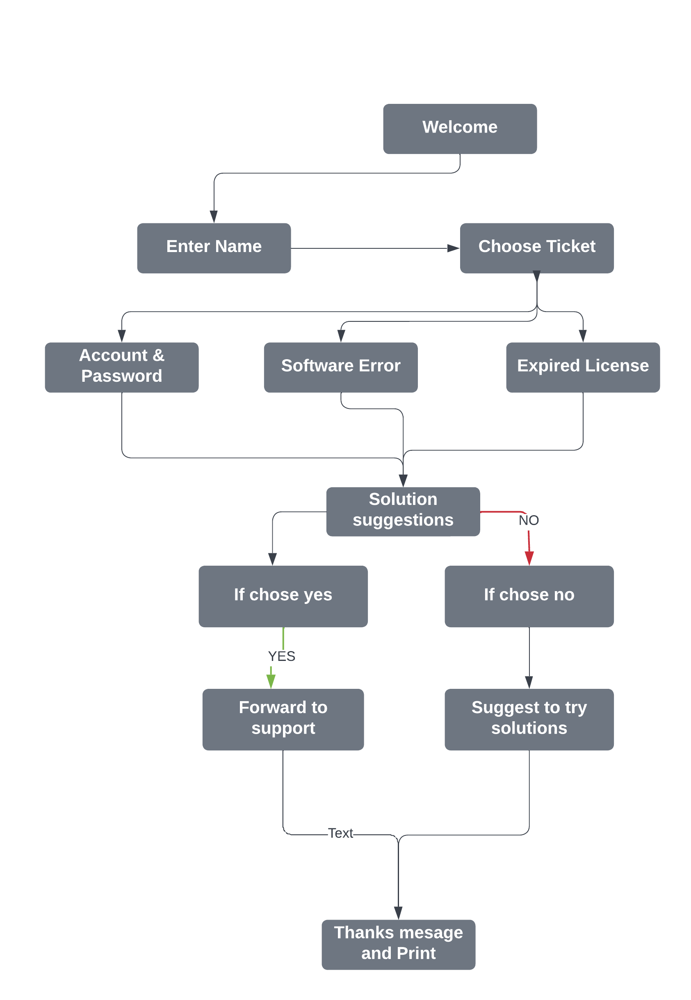
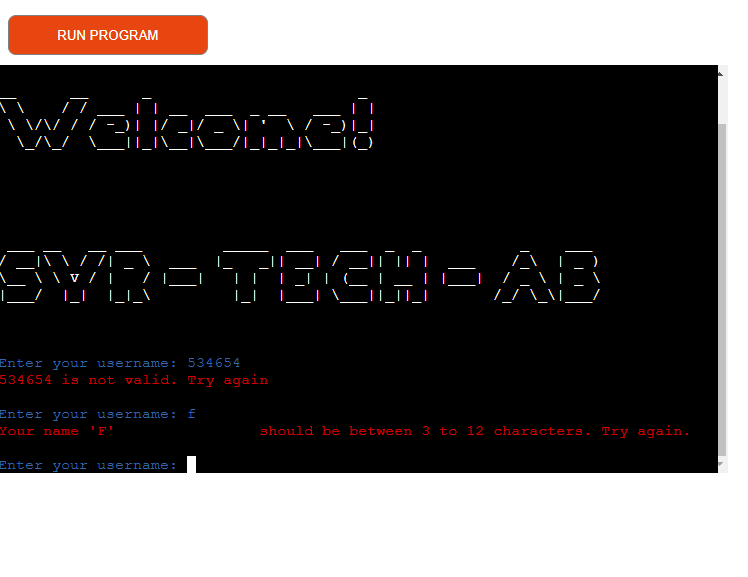
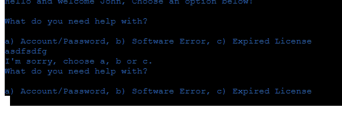
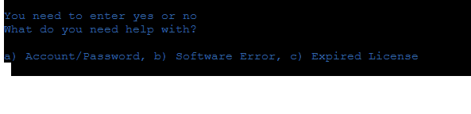
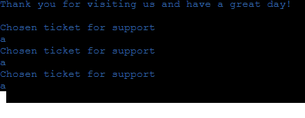
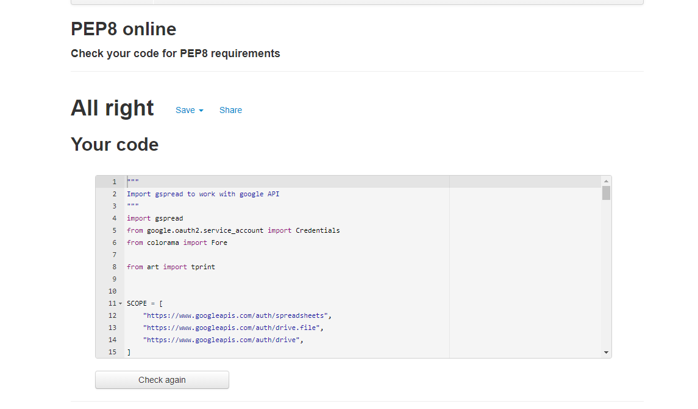

# My-Sub My-Way

[View the Live Project Here](https://syr-tech.herokuapp.com/)

## TABLE OF CONTENTS
- [Introduction of the project](#introduction)
- [User Experience or User Interface](#user-experience-or-user-interface)
- [Design](#design)
- [Features](#features)
- [Testing](#testing)
- [Technology](#technology)
- [Deployment](#deployment) 
- [Credits](#credits)
- [Appreciation](#appreciation)

## Introduction of the project

### Reason behind this project. 
We, the users of modern technology face problems and errors almost at every aspect of life. 
Whether it's our phone or  a scanner at a supermarket. Hence, we seek support when an unexpected problem/error arises and sometimes it takes a longer time
to get that support we need. At times it can be miserable to get support while waiting on the call for hours, therefore many companies have therefore come up with solutions such as FAQ's (Frequently asked questions) or chatbots to speed up the process. I work in the field of IT related support. Therefore, I as both the user and the support have a better understanding of how this process could be more effective and time saving. For this reason I have decided to create this project.

## User Experience or User Interface

### First Time User.
As a first time user, I want:
- To have a clear understanding of the process.
- To understand the mentioned categories for system solutions.
- To find my way through the command system.
- To be able to understand and comprehend the command rules with ease.
- To be guided to find solutions for the problems/errors.
- To skip the pressure of waiting in support calls and instead find quick solutions.
- To easily use the command system by typing easy and quick answers.

### Returning User.
As a returning or frequent user, I want:
- To know my way around the system.
- To familiarize myself with the system.
- To find the related category for my problems.

### Frequent User.
As a frequent user, I want:
- To easily and quickly find the necessary information .
- To know if the suggested solutions are applicable for my problems.
- To save time by quickly browsing and if necessary contacting the support line.

## Design

### Basic Design
The core design of this project was initally  built by using lucidchart, creating a logic chart to better understand the functions and their use.
Once I have settled with core concept of the project, I have decided to add some color and a logo to be more welcoming towards the user.
The colors used in this project are;
- Blue, for the general text, questions and answers.
- Red, to better express the error to the user.

## Features
There features of this project consists of -
- The user must enter a username and it should be between 3 to 12 characters.
- The terminal throws a message to the user when -
    - There are any special characters in the name.
    - There are any numbers in the name.
    - Or there is an empty name input.
    - The image of the error when the name is not accepted;

     

- The user receives a welcome text.
- The user has to choose between 3 categories ir order to find the necessary solution, which is (a,b or c)

- The terminal throws a message to the user when -
    - The user types a number.
    - the user types any letter but a or b.
    - The user inputs nothing and press enter.
    - The user types special characters.
    - The image of error when typed wrong and is not accepted; 

    

- The user is asked if they have tried the suggested solutions and user must enter yess or no (yes/no).
- The terminal throws a message to the user when -
    - The user types letters instead of numbers.
    - The user types multiple numbers instead of one number.
    - The user types a number that is not in the list.
    - The user inputs nothing and presses enter.
    - The user types special characters.
    - Image of Error when typed wrong and  is not accepted. 
    
    

- Once the user has gone through categories and solutions, the support line number is given or a thank you message pops up. 

-

-

## Testing
Testing has occured ont he PEP8 online checker. 
- I have pasted the  code from run.py file on PEP8 online checker. 
- Check for potential problems/errors and fix them.
The test was successful and no errrors were found.

 
## Technology

### Used Languages
- Python

### Application Used
- [GitPod](https://www.gitpod.io/) is used as an online IDE.
- [Google API](https://console.cloud.google.com/) is used to fetch and insert data into sheets.
- [GitHub](https://github.com/) is used as a repository and for version control.
- [Heroku](https://dashboard.heroku.com/apps/my-sub-my-way) is used to deploy the website.

### Frameworks/Packages Used

- gspread
    > gspread is used to fetch and insert user data into sheets.
- google.oauth2.service_account
- art
    > art is used to print the logo and welcome sign for the users..
- colorama
    > colorama is used for adding color to basic command line text.

## Deployment
Gitpod was used as workspace to create this project. The[Code Institute's Template](https://github.com/Code-Institute-Org/python-essentials-template) is used for this project.

1. Click on [Code Institute's Template](https://github.com/Code-Institute-Org/python-essentials-template) and then click on use this template button.
2. Add the name of the project, select on PUBLIC and click Create Repository.
3. Click the Gitpod button. Once Gitpod is loaded, the coding can begin.
4. In order to save and commit changes for the project. The following steps must be followed -
    - git add . 
    - git commit -m "Changes/Message"
    - git push

The git terms are described below;

*.git add*  adds the code to the repository.

*git commit -m "your message"* commits your changes, for a better understanding of code changes.

*git push* To push changes into consol and update the old version.

### Setup API

1. Navigate to [Google Cloud Platform](https://cloud.google.com/gcp/?utm_source=google&utm_medium=cpc&utm_campaign=emea-gb-all-en-bkws-all-all-trial-e-gcp-1011340&utm_content=text-ad-none-any-DEV_c-CRE_500227884420-ADGP_Hybrid%20%7C%20BKWS%20-%20EXA%20%7C%20Txt%20~%20GCP%20~%20General%23v1-KWID_43700060384861702-kwd-26415313501-userloc_9041106&utm_term=KW_google%20cloud%20platform-NET_g-PLAC_&gclid=CjwKCAiAvaGRBhBlEiwAiY-yMH6ZzZToth-9fTjp0B_qAE91ulGwN7jIb0KBGW5TbmN8Z5w9JE1noRoCSmIQAvD_BwE&gclsrc=aw.ds)

2. Create a free account (if you don't have an account) by clicking the 'Get Started for Free' button on the upper right corner.

3. Once the account is created, click on the Create New Project button and add the name of the project.

4. Head over to the menu and click 'Library', and select API followed by Services.

5. Search Google Drive API and enable it.

6. Search Google Sheet API and enable it.

7. In the top left corner, click Create credentials and select Google drive from the dropdown menu.

8. Select Application Data.

9. Select NO, I'm Not.

10. Click Next.

11. Enter the Service Account name (the name for your chosen project).

12. Click create and continue.

13. In the Role Dropdown box select Basic and click continue.

14. On the next page click Done.

15. Click on the service account that has been created and navigate to the Keys tab.

16. Click on Add Key and select Create New Key.

17. Select JSON and click Create. This will download the file on your computer.

18. From your computer, add the downloaded file to gitpod and rename it to creds.json.

19. Open creds.json and copy the value of the client's email.

20. Go to google sheet and click share, paste the email address, make sure to assign the role as the Editor.

- Enabling the API
1. On the gitpod terminal, enter the following code:
    'pip3 install gspread google-auth'

2. Add the code(the image below) on the terminal and enable to have acces with the google spreadsheet.

[API](assets/images/apis.png)

### Deploying Locally

1. Navigate to the github [Repository](https://github.com/shahid129/my-sub-my-way).

2. Click on the drop down menu CODE.

3. Click on Download Zip and run locally on your machine or copy GIT URL from the HTTPS link.

4. Open your favorite IDE or editor and open the terminal.

5. Change the current working directory to the location where you want the cloned directory.

5. Use the 'git clone' command and paste the copied git URL.

6. Press enter to create clone on your device.

### Deploying the project using Heroku

The code below needs to be entered on the terminal before starting with the deployment process on Heroku.

    pip3 freeze --local > requirements.txt

1. Navigate to [heroku](https://www.heroku.com/) and click sign up to create a new account.

2. Click the New button and click Create New APP.

3. Add a name for app in the APP-Name field.

4. Select your region from the drop down menu and click on Create App button.

5. On the next page click on the Settings tab to adjust the settings.

6. Click on the 'config vars' button.

7. You must then create a Config Var called PORT. Set this to 8000 as value.

8. Click on the ADD Build button.

9. Add python buildpack and then node.js. The sequence of adding bulidpack has to be in correct order.

10. Navigate to deploy screen, select github and connect your github profile.

11. Now you can deploy the app automatically or manually. Automatic deploymewnt will update the app automatically every time you push any changes to github.

12. Once the build is successful, you can open the app by clicking Open App button on the top right corner.

## Credits

>I was inspired by the below sources;
- [Stack Overflow](https://stackoverflow.com/)
- [W3Schools](https://www.w3schools.com/)
- [Python in Plain English](https://python.plainenglish.io/build-a-fast-food-order-taker-in-python-87188efcbbdd)

## Appreciation
> I really appreciate all the help that I have recieved and therefore would like to thank my tutors and my mentor Ronan. For the amazing suggestions, feedbacks and comments on my project.